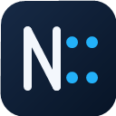

<div align="center">
  
  <h1>Notepad::</h1>
  <p><strong>A fast, focused text and code editor for Windows.</strong></p>
  <p>Native C++ · No plugins · No telemetry · No background indexing</p>
</div>

Notepad:: brings the everyday editing strengths people value in Notepad++
to a focused native Windows application. It starts as an editor—not an IDE—and
keeps expensive language servers, accounts, cloud services, and project-wide
code indexing out of the process.

> **Project status:** early preview. Core editing, search, recovery, syntax
> highlighting, folder browsing, and large-file workflows are implemented and
> covered by automated tests. Interfaces may still change before 1.0.

## Why Notepad::?

| | Notepad:: approach |
|---|---|
| **Fast by default** | Native Win32 UI built with [mwfl](https://github.com/mwfl/mwfl) and Scintilla |
| **Focused** | Editing and search without plugins, LSP processes, or IDE project systems |
| **Safe** | Atomic saves, external-change detection, backups, session recovery, and encoding checks |
| **Large-file aware** | Editable fixed-memory windows for UTF-8 files through exactly 4 GiB |
| **Private** | No accounts, telemetry, analytics, or cloud services |

## Highlights

### Everyday code editing

- Native multi-document tabs, recent files, drag and drop, bookmarks, folding,
  multiple and rectangular selections, brace matching, line operations,
  whitespace controls, wrapping, and zoom.
- Syntax highlighting for 19 common languages through Scintilla and Lexilla.
- Incremental Tree-sitter parsing for C++, JSON, Python, JavaScript/JSX, and
  TypeScript/TSX, including document symbols and visible-range coloring.
- Explicit `Ctrl+Space` completion from language keywords, current-document
  identifiers, and current-document symbols—with no language server or folder
  index.

### Search that stays useful

- Incremental find, match case, whole word, regular expressions, selection
  scope, wraparound, replace, history, and bounded **Mark All**.
- Cancellable folder and open-document search with previews, include/exclude
  globs, `.gitignore`, multiline patterns, binary detection, and safety limits.
- A lazy workspace tree and fuzzy Quick Open. Opening a folder does not trigger
  background analysis.

### Files and encodings

- UTF-8/BOM, UTF-16 LE/BE, checked ANSI code pages, CRLF/LF conversion, and
  `.editorconfig`.
- Lossless conversion checks, mixed-EOL reporting, and warnings for bidi and
  zero-width characters.
- Safe atomic replacement, optional backup-before-save, conflict detection, and
  crash/session recovery—including unsaved documents.

### Large files without large memory use

- Files through 32 MiB open in the regular editor.
- UTF-8 files above 32 MiB through exactly 4 GiB use an editable 8 MiB window
  backed by a piece table.
- Windowed scrolling, insert/delete, fixed-memory full-file literal search,
  conflict-safe streaming save, and follow-tail are supported.
- Other large encodings remain read-only until byte-to-character mapping can be
  guaranteed lossless.

See [Large-file testing](docs/large-file-testing.md) for the reproducible 100 MiB
and 4 GiB verification workflow.

## Supported systems

- Windows 10 or newer
- x64 (current packaged build)
- MSVC C++20 with Visual Studio 2026

## Build from source

Prerequisites: Visual Studio 2026 with Desktop development with C++ and CMake.
Standalone builds fetch the pinned MWFL `v0.1.1` release; set
`MWFL_SOURCE_DIR` when developing against a local mwfl checkout.

```powershell
cmake --preset vs2026-x64
cmake --build --preset vs2026-x64-debug --parallel
ctest --preset vs2026-x64-debug
```

Create the portable ZIP:

```powershell
cmake --build --preset vs2026-x64-release --target package
```

The package contains `notepad-colon.exe`, Scintilla, Lexilla, notices, and this
guide. Launching it makes no registry changes. The optional `.txt` association
is explicit, reversible, and available under **Tools**.

## Project scope

Notepad:: deliberately excludes plugins, LSP processes, semantic project
indexing, IDE project systems, accounts, telemetry, and cloud services. Opening
a folder provides bounded navigation and on-demand search; it does not turn the
folder into a project or analyze its code in the background.

Read the detailed [product scope](docs/product-scope.md) and the guide for
[custom languages](docs/custom-languages.md).

## Validation

CTest covers the model layer, real native-window GUI behavior, single-instance
forwarding, isolated Shell registration, a 34 MiB edit/save integration path,
Tree-sitter and Wasm syntax handling, and an exact-4-GiB piece-table/search
performance guard. GitHub Actions builds, tests, packages, and uploads the x64
portable artifact.

## License

Notepad:: is released under the [MIT License](LICENSE). Third-party
components and grammar licenses are listed in
[THIRD-PARTY-NOTICES.md](THIRD-PARTY-NOTICES.md).

## Releases

Notepad:: never checks the network for updates. Microsoft Store installations
are updated by the Store, while Portable users can choose when to download a
new version from the GitHub Releases page. Tag releases publish a versioned
`windows-x64-portable.zip` plus SHA-256 checksums.

Build the Store MSIX from an existing Release configuration with:

```powershell
./scripts/build-store-msix.ps1
```

The script stages the product files, applies the Partner Center package identity,
generates the required logo sizes from the repository icon, and validates the
manifest while packing `artifacts/store/notepad-colon-1.2.0.0-x64.msix`.
